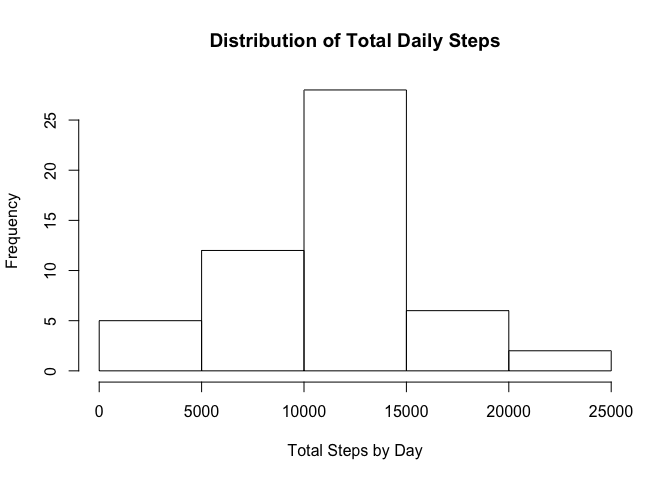
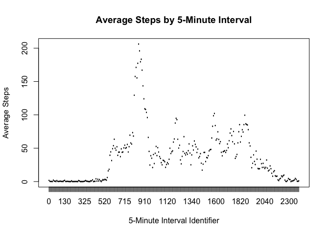
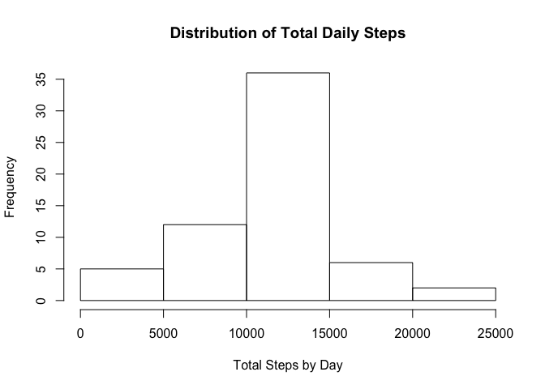
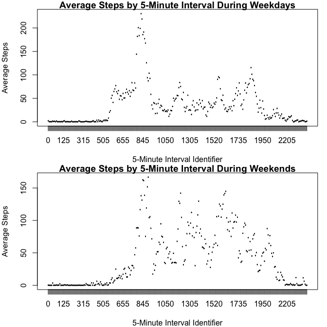

# Reproducible Research: Peer Assessment 1
Rachel Stephens  
December 18, 2015  


## Loading and preprocessing the data

### Loading data
The data records steps taken by subjects as measured by personal fitness devices. 


```r
fileURL <- "https://d396qusza40orc.cloudfront.net/repdata%2Fdata%2Factivity.zip"
download.file(fileURL, destfile = "dataset.zip", method = "curl")
unzip("dataset.zip")
unlink("dataset.zip")
data <- read.csv("activity.csv")
```

There are 17568 observations and 3 variables:  
- **steps:** number of steps taken during the interval  
- **date:** date of measurement  
- **interval:** 5-minute interval identifier  

### Processing data


```r
data$date <- as.Date(data$date, "%Y-%m-%d")
data$interval <- as.factor(data$interval)
```

## What is the mean total number of steps taken per day?

### Total steps

```r
stepsTotal <- aggregate(steps~date, data = data, FUN = sum, na.rm = TRUE)
sum(stepsTotal$steps)
```

```
## [1] 570608
```

The participants took a total of 570608 steps. 

### Step distribution by day

```r
hist(x = stepsTotal$steps, main = "Distribution of Total Daily Steps", xlab = "Total Steps by Day")
```

 

The distribution of total steps taken by day is relatively normal, with a center of 10766.19 and a standard deviation of 4269.1804927.

### Average total daily steps

```r
stepsMean <- mean(stepsTotal$steps, na.rm = TRUE)
stepsMean
```

```
## [1] 10766.19
```

```r
stepsMedian <- median(stepsTotal$steps, na.rm = TRUE)
stepsMedian
```

```
## [1] 10765
```

The mean total steps taken per day is 10766.19.
The median total steps taken per day is 10765.

## What is the average daily activity pattern?

```r
# isolate variables for plot
stepsInt <- aggregate(steps~interval, data = data, FUN = mean, na.rm = TRUE) 

plot(stepsInt$interval, stepsInt$steps, type = "l", main = "Average Steps by 5-Minute Interval", xlab = "5-Minute Interval Identifier", ylab = "Average Steps")
```

 

Because we changed the interval variable to be a factor instead of a continuous varible, the time series shows individual points for each interval rather than a continuous line. This more accurately conveys the hour/minute nature of the variable.  

From this plot, we can see that activity spikes between the 800th and 1000th interval identifiers, or roughly between 8:00 AM and 10:00 AM.


```r
stepsMax <- stepsInt[stepsInt$steps == max(stepsInt$steps), ]
stepsMax
```

```
##     interval    steps
## 104      835 206.1698
```

The most active time interval is 835 with an average of 206.1698113 steps.

## Imputing missing values

### Missing values

```r
indexNA <- is.na(data$steps)
sum(indexNA)
```

```
## [1] 2304
```

There are 2304 missing values in the data. 13.11% of data is missing.

### Impute missing values using time interval mean


```r
# create a new data frame for imputing values
imputeData <- data

# identify missing data and impute values using the mean for that 5-minute time interval
indexMeans <- match(imputeData[indexNA, ]$interval, stepsInt$interval)
imputeData[indexNA, ]$steps <- stepsInt[indexMeans, ]$steps
```

### Total steps with imputed values

```r
stepsTotalImp <- aggregate(steps~date, data = imputeData, FUN = sum, na.rm = TRUE)
sum(stepsTotalImp$steps)
```

```
## [1] 656737.5
```

With imputed values, the participants took a total of 656737.5 steps. 

Imputing values for missing data increased the number of total steps by 15.0943396%

### Step distribution by day with imputed values

```r
hist(x = stepsTotalImp$steps, main = "Distribution of Total Daily Steps", xlab = "Total Steps by Day")
```

 

The new distribution of total steps taken by day is still relatively normal, with a center of 10766.19 and a standard deviation of 3974.390746.

### Average of imputed daily steps

```r
stepsMeanImp <- mean(stepsTotalImp$steps, na.rm = TRUE)
stepsMeanImp
```

```
## [1] 10766.19
```

```r
stepsMedianImp <- median(stepsTotalImp$steps, na.rm = TRUE)
stepsMedianImp
```

```
## [1] 10766.19
```

The mean total steps taken per day is 10766.19.
The median total steps taken per day is 10766.19.

Because we imputed values based on the time interval's average, this had little effect on our center. Had we used the daily average or some other method of imputing NA's, we would likely have seen greater impact to the mean and median calculations.

## Are there differences in activity patterns between weekdays and weekends?

```r
# create a new factor variable to denote weekdays and weekends
imputeData["weekday"] <- factor(weekdays(imputeData$date) %in% c("Saturday", "Sunday"), labels = c("weekday", "weekend"))
```

First we need to create a factor variable to separate weekdays from weekends. Then we can plot both and compare. 


```r
par(mfrow = c(2, 1), mar = c(4, 4, 1, 1))

# isolate variables for weekday plot
dataWeekday <- imputeData[imputeData$weekday == "weekday", ]
stepsIntWeekday <- aggregate(steps~interval, data = dataWeekday, FUN = mean, na.rm = TRUE) 

# plot weekdays
plot(stepsIntWeekday$interval, stepsIntWeekday$steps, type = "l", main = "Average Steps by 5-Minute Interval During Weekdays", xlab = "5-Minute Interval Identifier", ylab = "Average Steps")

# isolate variables for weekend plot
dataWeekend <- imputeData[imputeData$weekday == "weekend", ]
stepsIntWeekend <- aggregate(steps~interval, data = dataWeekend, FUN = mean, na.rm = TRUE) 

# plot weekends
plot(stepsIntWeekend$interval, stepsIntWeekend$steps, type = "l", main = "Average Steps by 5-Minute Interval During Weekends", xlab = "5-Minute Interval Identifier", ylab = "Average Steps")
```

 

You see there is much more activity throughout the day on the weekeends than there is on weekdays. 
